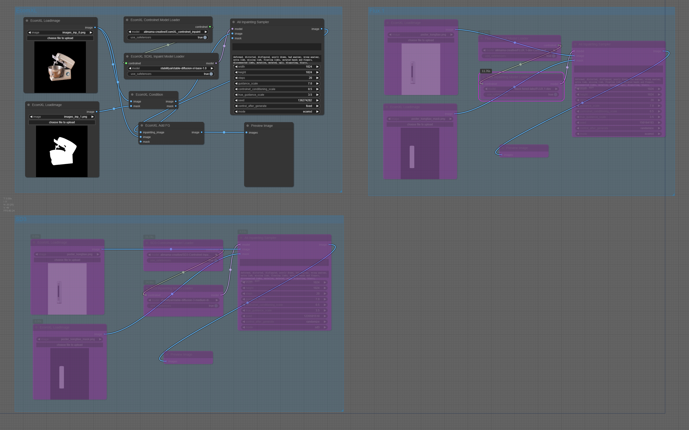

# ComfyUI nodes to use VideoEditing
 
https://huggingface.co/alimama-creative/EcomXL_controlnet_inpaint      
https://huggingface.co/alimama-creative/SD3-Controlnet-Inpainting    
https://huggingface.co/alimama-creative/FLUX.1-dev-Controlnet-Inpainting-Alpha    

## Install

- 推荐使用管理器 ComfyUI Manager 安装（On the Way）

- 手动安装：
    1. `cd custom_nodes`
    2. `git clone https://github.com/leeguandong/ComfyUI_AliControlnetInpainting.git`
    3. 重启 ComfyUI

## Model card
### EcomXL_controlnet_inpaint
In the first phase, the model was trained on 12M laion2B and internal source images with random masks for 20k steps. In the second phase, the model was trained on 3M e-commerce images with the instance mask for 20k steps.
Mixed precision: FP16
Learning rate: 1e-4
batch size: 2048
Noise offset: 0.05

### SD3-Controlnet-Inpainting
Finetuned controlnet inpainting model based on sd3-medium, the inpainting model offers several advantages:
Leveraging the SD3 16-channel VAE and high-resolution generation capability at 1024, the model effectively preserves the integrity of non-inpainting regions, including text.
It is capable of generating text through inpainting.
It demonstrates superior aesthetic performance in portrait generation.

The model was trained on 12M laion2B and internal source images for 20k steps at resolution 1024x1024.

Mixed precision : FP16
Learning rate : 1e-4
Batch size : 192
Timestep sampling mode : 'logit_normal'
Loss : Flow Matching

### FLUX.1-dev-Controlnet-Inpainting-Alpha
The model was trained on 12M laion2B and internal source images at resolution 768x768. The inference performs best at this size, with other sizes yielding suboptimal results.
The recommended controlnet_conditioning_scale is 0.9 - 0.95.
Please note: This is only the alpha version during the training process. We will release an updated version when we feel ready.

## Stars 

